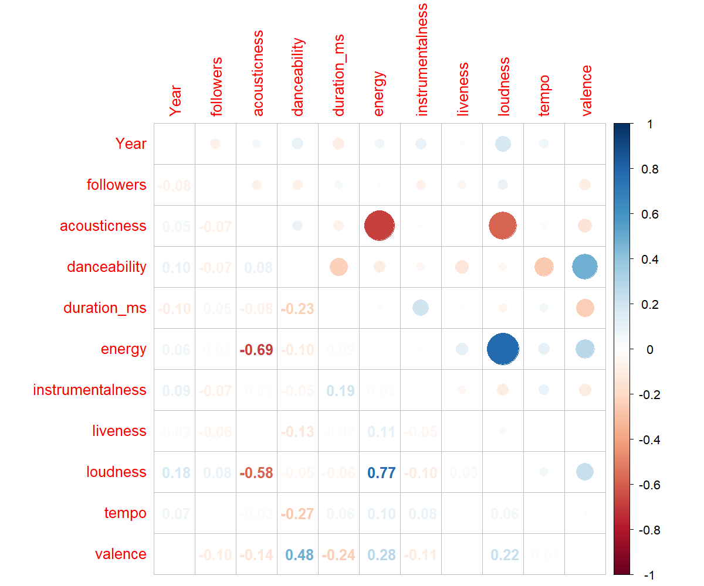
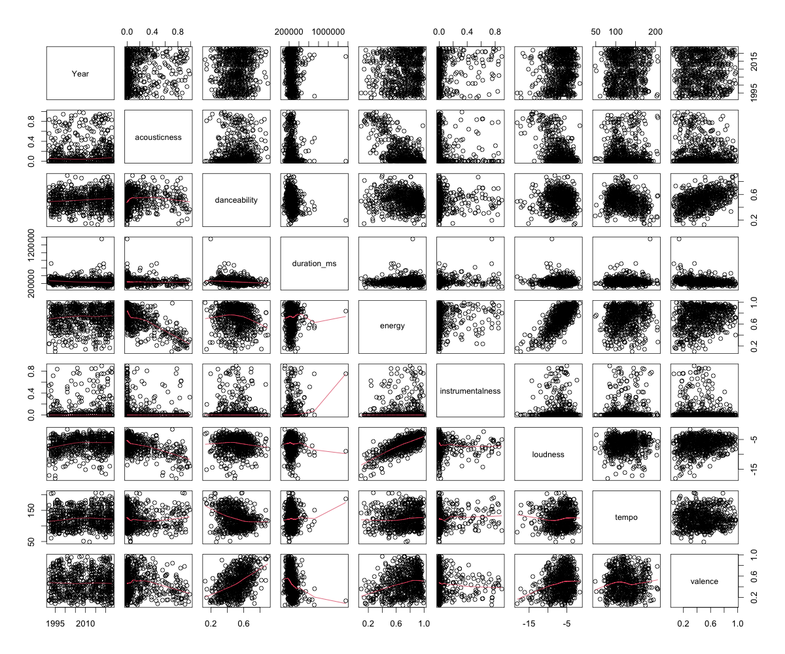
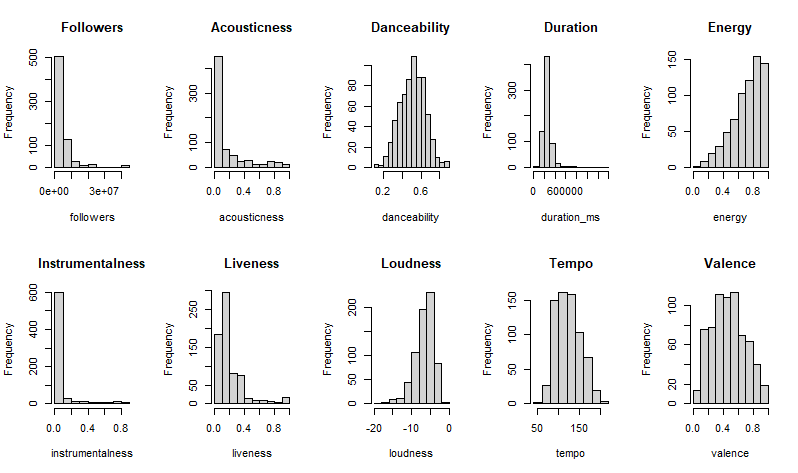

```{r setup, include=FALSE}
knitr::opts_chunk$set(echo = TRUE)
```

## Can we use attributes and metrics of rock songs to predict their likelihood of winning the Grammy for "Best Rock Song?"

What common traits, if any, do award winning rock songs contain? Can we look at intrinsic traits of songs, combined with metrics defined by Spotify, to determine award winning musical features? In this paper, we break down our data collection, data processing, and data analysis of a dataset of roughly 1,000 popular songs, both award-winning and not.

## The Data

### Data Collection and Preparation

In order to investigate this, we first collected a list of every song nominated for the "Best Rock Song" Grammy. The reason that we kept it within one award, rather than include other rock related Grammy's ("Best Rock Performance," "Best Rock Album," etc.), is because they are disparate by nature and nominations are awarded for completely different reasons. The Best Rock Song Grammy competition is between individual songs, allowing us to compare them to each other and determine what attributes mold a work worthy of a nomination.

In order to examine what sets these nominations apart from other rock songs, we collected the top 10 songs of each of these previously nominated artists so that we could compare the features and attributes of their popular non-nominated songs to songs that earned a nomination. This created a dataset of 1,016 popular rock songs. As a final step of processing the data, we had to remove any songs that were released prior to the creation of this Grammy in 1992. Removing all songs older than 1992 yielded a final dataset of 867 songs.

```{r warning = FALSE, echo = TRUE, message = FALSE}
# Set the working directory to this file's folder
library("rstudioapi")
setwd(dirname(getActiveDocumentContext()$path))
load("final_df_n_str.RData")

Sys.setenv(LANG = "en") 

# Load necessary libraries
library(pROC)
library(MASS)
library(ROSE)
library(confintr)
library(ggplot2)
library(correlation)
library(corrplot)
library(class)
library(caret)
library(glmnet)
```

```{r, echo = TRUE, results = 'hide'}
# Selecting the relevant variables
data = final_df_n_str
data = data[,c("track_name", "artist_name", "IsWinner", "Year","year",
               "followers", "acousticness", "danceability", "duration_ms",
               "energy", "instrumentalness", "key", "liveness", "loudness",
               "mode", "tempo", "time_signature", "valence")]

# Merge the two year variable
data$Year[data$Year == "Undefined"] <- data$year[data$Year == "Undefined"]
data = data[,c("track_name","artist_name", "IsWinner", "Year", "followers",
               "acousticness", "danceability", "duration_ms",
               "energy", "instrumentalness", "key", "liveness", "loudness",
               "mode", "tempo", "time_signature", "valence")]

# Eliminating duplicates
data$track_name == "Closing Time"
data$track_name == "Smells Like Teen Spirit"
data$track_name == "Don't Wanna Fight"
data[914, ]
data[789,]
data[669,]

data = data[-c(669, 789, 914),]

sum(data$Year < 1992)
nrow(data)
data = data[!data$Year < 1992,]

# Creating row names

names = paste0(data$track_name, " - ", data$artist_name)

# Eliminating unusable variables
data = data[,c("IsWinner", "Year", "followers", "acousticness",
               "danceability", "duration_ms", "energy",
               "instrumentalness", "key", "liveness", "loudness", "mode",
               "tempo", "time_signature", "valence")]
data = cbind(names = names, data)

# Casting variables
data$IsWinner[data$IsWinner == "Winner"] = 1
data$IsWinner[data$IsWinner == "Nominee"] = 1
data$IsWinner[data$IsWinner == "Nothing"] = 0
data$IsWinner = as.integer(data$IsWinner)
data$Year = as.integer(data$Year)
data$mode = as.factor(data$mode)
data$key = as.factor(data$key)
data$time_signature = as.factor(data$time_signature)

summary(data)
```

```{r}
# Checking balance between classes

# Non-Grammy nominated songs
length(data$IsWinner[data$IsWinner == 0]) / (length(data$IsWinner[data$IsWinner == 0]) + length(data$IsWinner[data$IsWinner == 1]))

# Grammy nominated songs
length(data$IsWinner[data$IsWinner == 1]) / (length(data$IsWinner[data$IsWinner == 0]) + length(data$IsWinner[data$IsWinner == 1]))
```

From the balance check, it is seen that the classes are highly imbalanced: 82% non-nominated songs, 18% nominated songs. We make note of this during the data processing stage so that we may take measures to address this during our analysis.

### Explanation of Variables

In order to perform analysis of the songs, we decided to use metrics that are intrinsic to music as well as artificial metrics created and measured by the music streaming giant Spotify. The intrinsic metrics we used were: duration, musical key, modality (major or minor key), tempo, and time signature. Spotify also uses what they call ["audio features"](https://developer.spotify.com/documentation/web-api/reference/get-several-audio-features) (in the table below) to perform their own analysis of songs when creating playlists, suggesting music, etc. We used these professionally manufactured metrics to bolster the intrinsic metrics and increase our insight into what might make a song award-winning.

Audio Feature | Definition
------------- | -------------
Acousticness  | A confidence measure from 0.0 to 1.0 of whether the track is acoustic. 1.0 represents high confidence the track is acoustic.
Danceability  | Danceability describes how suitable a track is for dancing based on a combination of musical elements including tempo, rhythm stability, beat strength, and overall regularity. A value of 0.0 is least danceable and 1.0 is most danceable.
Energy        | Energy is a measure from 0.0 to 1.0 and represents a perceptual measure of intensity and activity. Typically, energetic tracks feel fast, loud, and noisy. For example, death metal has high energy, while a Bach prelude scores low on the scale. Perceptual features contributing to this attribute include dynamic range, perceived loudness, timbre, onset rate, and general entropy.
Instrumentalness | Predicts whether a track contains no vocals. "Ooh" and "aah" sounds are treated as instrumental in this context. Rap or spoken word tracks are clearly "vocal". The closer the instrumentalness value is to 1.0, the greater likelihood the track contains no vocal content. Values above 0.5 are intended to represent instrumental tracks, but confidence is higher as the value approaches 1.0.
Liveness      | Detects the presence of an audience in the recording. Higher liveness values represent an increased probability that the track was performed live. A value above 0.8 provides strong likelihood that the track is live.
Loudness      | The overall loudness of a track in decibels (dB). Loudness values are averaged across the entire track and are useful for comparing relative loudness of tracks. Loudness is the quality of a sound that is the primary psychological correlate of physical strength (amplitude). Values typically range between -60 and 0 db.
Speechiness   | Speechiness detects the presence of spoken words in a track. The more exclusively speech-like the recording (e.g. talk show, audio book, poetry), the closer to 1.0 the attribute value. Values above 0.66 describe tracks that are probably made entirely of spoken words. Values between 0.33 and 0.66 describe tracks that may contain both music and speech, either in sections or layered, including such cases as rap music. Values below 0.33 most likely represent music and other non-speech-like tracks.
Valence       | A measure from 0.0 to 1.0 describing the musical positiveness conveyed by a track. Tracks with high valence sound more positive (e.g. happy, cheerful, euphoric), while tracks with low valence sound more negative (e.g. sad, depressed, angry).

Although Spotify does not openly share how they determine these metrics, we found them suitable to assist in our analysis.

As a final processing step, we split the data into training and test datasets. The training dataset contains 80% of the original dataset, and the remaining 20% of the data in the test dataset will be used to test our model against after we have trained it. It is very important to test the model on never-before-seen data to determine not only how well the model performs, but also how well the model can generalize.

```{r, echo = TRUE, eval = TRUE}
# Splitting training and test set
training_size = floor(0.8 * nrow(data))
set.seed(42)
train_ind = sample(seq_len(nrow(data)), size = training_size)
training_set = data[train_ind,]
test_set = data[-train_ind,]

summary(training_set)

# Checking if the ratio is preserved

# Ratio of training set:
# - not-nominated
length(training_set$IsWinner[data$IsWinner == 0]) / (length(training_set$IsWinner[data$IsWinner == 0]) + length(training_set$IsWinner[data$IsWinner == 1]))
# - nominated
length(training_set$IsWinner[data$IsWinner == 1]) / (length(training_set$IsWinner[data$IsWinner == 0]) + length(training_set$IsWinner[data$IsWinner == 1]))

# Ratio of Test Set
# - not-nominated
length(test_set$IsWinner[data$IsWinner == 0]) / (length(test_set$IsWinner[data$IsWinner == 0]) + length(test_set$IsWinner[data$IsWinner == 1]))
# - nominated
length(test_set$IsWinner[data$IsWinner == 1]) / (length(test_set$IsWinner[data$IsWinner == 0]) + length(test_set$IsWinner[data$IsWinner == 1]))
```

## Exploratory Data Analysis

### Relationship Between Independent Variables

At first, we took a look at the variables by examining their correlation, which is the measurement of association between two variables. This is essentially a measurement of how similar the information we learn from different variables are. The larger the correlation between independent variables (negative or positive), the higher their collinearity, meaning the information they each carry is similar. This means their use together is less beneficial due to redundancy and we should avoid the pairing. We would prefer different variables which offer different information to our model.

It was important for us to understand our data better in these regards, so that we may know which attribute pairings could give useful insight.

#### Correlation Between Contiuous Variables

```{r, message = FALSE}
attach(training_set)
# Correlations between continuous variables
cor_matrix = cor(training_set[,c(-1, -2, -10, -13, -15)])
```
```{r, eval=FALSE}
# Plot the correlation
corrplot.mixed(cor_matrix, tl.pos='lt')
```

```{r, echo=FALSE}

```

DISCUSS  THE ABOVE PLOT; POINT OUT LARGE CORELATION

The 4 major pairings of:
- means they are not very beneficial
- Interesting to see that a song that has high energy often has high loudness (interesting for its own sake, not necessarily for our project)

```{r, eval = FALSE}
pairs(training_set[,c(-1, -2, -10, -13, -15)], lower.panel = panel.smooth)
```

```{r, echo=FALSE}

```

DISCUSS THE ABOVE PLOT; TALK ABOUT THE SHAPES (BLobs, slightly linear, etc); TALK ABOUt THE RED LINES AND WHAT THEIR DIRECTION AND LINEARTY MEANS

MORE INFORMATION

Evaluating with this plot, we were able to understand the shape of the data and discover outliers as well as general trends. For example, almost the entore trend line of DUration vs Instrumentalness is caused by a single outlier. It also confirmed the high coralation between loudness and energy, showing a nice upward durection of the trend line, as well as for valence and danceability (although those data have higher variability).

Line is average of the dots? (CONFIRM)

pos corr means 2 varibales change int he same direction; both grow or both decrease
neg corr means one increases and the other decrease
best correlation is 0 for independent variables

When looking between indep and depend var's we want correlation as high as possible
Helps to predict

Correlation is only a linear relationship; could be non-linear relationship

#### Correlation Between Categorical Variables

In order to determine the strength of similarity between the categorical variables, we employed the Cramer's V measurement. This measurement is a normalized version of the chi-square statistic, returning a value of 0 if there is no association between the categorical variables, and returning 1 if there is a perfect association in which one variable is completely determined by the other. (EXPAND ON CRAMER'S V MEASUREMENT)

```{r, warning=FALSE}
# Association measure for categorical variables (Cramer's V is a normalized 
# version of the chi-square statistics)
cramersv(matrix(c(as.numeric(key), as.numeric(mode)), ncol = 2))
cramersv(matrix(c(as.numeric(key), as.numeric(time_signature)), ncol = 2))
cramersv(matrix(c(as.numeric(mode), as.numeric(time_signature)), ncol = 2))
```

Most valuable iformation from Cramer:
- Not fully dissacociated from each other!

#### ANOVA

Next, we looked for associations between each of the categorical variables (Key, Mode, and Time Signature) and all of the continuous variables utilizing ANOVA. ANOVA (or ANalysis Of VAriation) offers a way to compare continuous and categorical variables by studying their variations. If ANOVA points out some feature combinations are significant, then that means the attributes are different. (EXPAND HERE BRIEFLY). Chose 5% as the threshold for significance. Following combinations were significant:

ANOVA makes some assumptions, which are not fully satisfied by our variables, meaning the results we obtained are not completely correct (REWORD).

```{r, warnings = FALSE}
# Association between continuous and categorical variables

# Key
fol_key.aov <- aov(followers ~ key)
summary(fol_key.aov) # SIGNIFICANT

aco_key.aov <- aov(acousticness ~ key)
summary(aco_key.aov)

dan_key.aov <- aov(danceability ~ key)
summary(dan_key.aov) # SIGNIFICANT

dur_key.aov <- aov(duration_ms ~ key)
summary(dur_key.aov)

ene_key.aov <- aov(energy ~ key)
summary(ene_key.aov) # SIGNIFICANT

ins_key.aov <- aov(instrumentalness ~ key)
summary(ins_key.aov)

liv_key.aov <- aov(liveness ~ key)
summary(liv_key.aov)

loud_key.aov <- aov(loudness ~ key)
summary(loud_key.aov)

tem_key.aov <- aov(tempo ~ key)
summary(tem_key.aov)

val_key.aov <- aov(valence ~ key)
summary(val_key.aov)


# Mode
fol_mode.aov <- aov(followers ~ mode)
summary(fol_mode.aov) # SIGNIFICANT

aco_mode.aov <- aov(acousticness ~ mode)
summary(aco_mode.aov) # SIGNIFICANT

dan_mode.aov <- aov(danceability ~ mode)
summary(dan_mode.aov)

dur_mode.aov <- aov(duration_ms ~ mode)
summary(dur_mode.aov)

ene_mode.aov <- aov(energy ~ mode)
summary(ene_mode.aov) # SIGNIFICANT

ins_mode.aov <- aov(instrumentalness ~ mode)
summary(ins_mode.aov)

liv_mode.aov <- aov(liveness ~ mode)
summary(liv_mode.aov)

loud_mode.aov <- aov(loudness ~ mode)
summary(loud_mode.aov) # SIGNIFICANT

tem_mode.aov <- aov(tempo ~ mode)
summary(tem_mode.aov)

val_mode.aov <- aov(valence ~ mode)
summary(val_mode.aov)


# Time signature
fol_time.aov <- aov(followers ~ time_signature)
summary(fol_time.aov)

aco_time.aov <- aov(acousticness ~ time_signature)
summary(aco_time.aov) # SIGNIFICANT

dan_time.aov <- aov(danceability ~ time_signature)
summary(dan_time.aov) # SIGNIFICANT

dur_time.aov <- aov(duration_ms ~ time_signature)
summary(dur_time.aov) # SIGNIFICANT

ene_time.aov <- aov(energy ~ time_signature)
summary(ene_time.aov) # SIGNIFICANT

ins_time.aov <- aov(instrumentalness ~ time_signature)
summary(ins_time.aov) # SIGNIFICANT

liv_time.aov <- aov(liveness ~ time_signature)
summary(liv_time.aov)

loud_time.aov <- aov(loudness ~ time_signature)
summary(loud_time.aov) # SIGNIFICANT

tem_time.aov <- aov(tempo ~ time_signature)
summary(tem_time.aov) # SIGNIFICANT

val_time.aov <- aov(valence ~ time_signature)
summary(val_time.aov) # SIGNIFICANT
```

The fact that x, y, z, etc. were significant allows us to confidently say there is a strong enough correlation between those parings and we may use them in our models in a beneficial manner.

#### Partial Correlations

TALK ABOUT PARTIAL CORRELATIONS; WHAT ARE THEY? WHAT DO THEY SHOW?

Every possible combination of continuous variables.

```{r, warnings = FALSE}
# Partial correlations
correlation(training_set[,c(-1, -2, -10, -13, -15)], partial = TRUE)

# Plots of variables with the largest partial correlation
ggplot(data = training_set, aes(danceability, valence)) + geom_jitter(color = "blue")
ggplot(data = training_set, aes(loudness, energy)) + geom_jitter(color = "blue")
ggplot(data = training_set, aes(acousticness, energy)) + geom_jitter(color = "blue")


#Weird song veeeeeeeeeeeeeeeeeeeeeeeery long 
which.max(data$duration_ms)
data[504, ]
```

TALK ABOUT WHY SOME MAY BE SIGNIFICANT; WHAT THAT MEANS.

### Distributions

We look at distributions to better understand the data and how we can interact with it. Some models we want to use are based on assumptions that are related to distributions, often times assuming a normal distribution of data. From gauging how different variables are distributed, we can create better models by taking their distribution assumptions into account.

#### Continuous

```{r, warnings = FALSE, eval=FALSE}
# Checking distributions

par(mfrow= c(2, 5))
 
# Continuous variables

hist(followers)
hist(acousticness)
hist(danceability)
hist(duration_ms)
hist(energy)
hist(instrumentalness)
hist(liveness)
hist(loudness)
hist(tempo)
hist(valence)
```

```{r, echo=FALSE}

```

DISCUSS CONTIN VAR'S

Mention normally distributed fatures (Dance, Valence) and the amount of skew found in the others

From these histograms, it is clear that the danceability feature is the most normally distributed. All others have a small skew at best (valence) to larger skews (tempo, loudness, energy) to seemingly exponential skews or individual values (duration, acousticness, followers, instrumentalness, liveness). As we build our models, we will keep these distributions in mind.

#### Categorical

```{r}
# Categorical variables

par(mfrow = c(1, 3))

barplot(table(key), main = "Key distribution")
barplot(table(mode), main = "Mode")
barplot(table(time_signature), main = "Time signature")
```

Evident mode of the categories in Mode and Time Signature; VERY high frequency

#### Relationship Between Independent and Dependent Variables

##### Continuous

```{r}
# Relationships between dependent and independent variables

par(mfrow= c(2, 5))

boxplot(danceability ~ training_set$IsWinner, xlab='Nominee Boolean')
boxplot(followers ~ training_set$IsWinner, xlab='Nominee Boolean')
boxplot(acousticness ~ training_set$IsWinner, xlab='Nominee Boolean')
boxplot(duration_ms ~ training_set$IsWinner, xlab='Nominee Boolean')
boxplot(energy ~ training_set$IsWinner, xlab='Nominee Boolean')
boxplot(instrumentalness ~ training_set$IsWinner, xlab='Nominee Boolean')
boxplot(liveness ~ training_set$IsWinner, xlab='Nominee Boolean')
boxplot(loudness ~ training_set$IsWinner, xlab='Nominee Boolean')
boxplot(tempo ~ training_set$IsWinner, xlab='Nominee Boolean')
boxplot(valence ~ training_set$IsWinner, xlab='Nominee Boolean')
```

More examination:
- Shows difference between classes within the context of individual, continuous features
- Energy and Valence are of use; seeing the difference in Median

##### Categorical

CHI SQUARED TEST

Measure of association; using it between Categorical variables and the 2 classes

```{r, warning=FALSE, message=FALSE}
par(mfrow = c(1, 1))

chisq.test(key, training_set$IsWinner)
chisq.test(mode, training_set$IsWinner)
chisq.test(time_signature, training_set$IsWinner)

cramersv(matrix(c(as.numeric(key), as.numeric(training_set$IsWinner)), ncol = 2))
cramersv(matrix(c(as.numeric(mode), as.numeric(training_set$IsWinner)), ncol = 2))
cramersv(matrix(c(as.numeric(time_signature), as.numeric(training_set$IsWinner)), ncol = 2))
```

#### Summary

Conclusion about what we have seen; what we plan to do with it? (Model fitting next)
- Found they are independent; these categorical variables alone do not offer much information regarding the classification


## Model Development

Explain our approach to modeling:

Talk about oversampling and why we chose to do it:
- Did we see an improvement in prediction compared to the original, unbalanced data set?

```{r}
## Oversampling

oversampled_train_data = ovun.sample(IsWinner ~., data = training_set[,-1], method = "over", p = 0.5, seed = 42)$data


# Checking oversampled training set balance

sum(oversampled_train_data$IsWinner == 0)
sum(oversampled_train_data$IsWinner == 1) 
```

### Logistic Model
Starting with a logistic model (Explain what it does?)

```{r}
## Simple logistic model

logistic = glm(IsWinner ~ ., data = training_set[,c(-1,-2)], family = "binomial")
summary(logistic)
```

What does this model say?

### Stepwise Variable Selection

Utilizing stepwise variable selection:

```{r}
# Stepwise variable selection

log_back = stepAIC(logistic, direction = "backward")

log_for = stepAIC(logistic, direction = "forward")

log_both =  stepAIC(logistic, direction = "both")
```

Possibly think about separating the 3 models and discussing them independently (Because the output it very large, would be difficult for the reader to scroll up and reference)

### Reduced Model

Fitting the reduced model (Is this according to the stepwise??) Discuss why we chose the features that we did for the reduced model:

```{r}
# Fitting the reduced model

logistic_reduced = glm(IsWinner ~ danceability + loudness + followers + valence + duration_ms + acousticness, data = training_set,  family = "binomial")

summary(logistic_reduced)
```

Summarize what this model shows:

#### Predicting

Making the predictions:

```{r}
# Computing predictions

logistic_predictions = predict(logistic_reduced, newdata = test_set[,c(-1, -2)], type = "response")
```

Inspect the predictions using different thresholds: .2, .3, and .4. Talk about what a threshold is and what changing it does.

##### Threshold = 0.2
```{r}
# Threshold = 0.2

logistic_predictions_02 = ifelse(logistic_predictions > 0.2, 1, 0)
logistic_accuracy_02 = sum(logistic_predictions_02 == test_set[2]) / dim(test_set[2])[1]

table(test_set$IsWinner, logistic_predictions_02)

false_positive_logistic_02 = table(test_set$IsWinner, logistic_predictions_02)[3]
negative_logistic_02 = table(test_set$IsWinner, logistic_predictions_02)[1] + table(test_set$IsWinner, logistic_predictions_02)[2]
typeIerror_logistic_02 = false_positive_logistic_02 / negative_logistic_02

true_positive_logistic_02 = table(test_set$IsWinner, logistic_predictions_02)[4]
positive_logistic_02 = table(test_set$IsWinner, logistic_predictions_02)[2] + table(test_set$IsWinner, logistic_predictions_02)[4]
sensitivity_logistic_02 = true_positive_logistic_02 / positive_logistic_02
```
Discuss what we see from this threshold:

ASK CRISTIAN: Should we just display the TypeIError here, or is it used somewhere else? Maybe we can make a table after looking at all the thresholds? Does that make sense in this context?

##### Threshold = 0.3
```{r}
# Threshold = 0.3

logistic_predictions_03 = ifelse(logistic_predictions > 0.3, 1, 0)
logistic_accuracy_03 = sum(logistic_predictions_03 == test_set[2]) / dim(test_set[2])[1]

table(test_set$IsWinner, logistic_predictions_03)

false_positive_logistic_03 = table(test_set$IsWinner, logistic_predictions_03)[3]
negative_logistic_03 = table(test_set$IsWinner, logistic_predictions_03)[1] + table(test_set$IsWinner, logistic_predictions_03)[2]
typeIerror_logistic_03 = false_positive_logistic_03 / negative_logistic_03

true_positive_logistic_03 = table(test_set$IsWinner, logistic_predictions_03)[4]
positive_logistic_03 = table(test_set$IsWinner, logistic_predictions_03)[2] + table(test_set$IsWinner, logistic_predictions_03)[4]
sensitivity_logistic_03 = true_positive_logistic_03 / positive_logistic_03
```
Discuss what we see from this threshold, incomparison to 0.2.

##### Threshold = 0.4
```{r}
# Threshold = 0.4

logistic_predictions_04 = ifelse(logistic_predictions > 0.4, 1, 0)
logistic_accuracy_04 = sum(logistic_predictions_04 == test_set[2]) / dim(test_set[2])[1]

table(test_set$IsWinner, logistic_predictions_04)

false_positive_logistic_04 = table(test_set$IsWinner, logistic_predictions_04)[3]
negative_logistic_04 = table(test_set$IsWinner, logistic_predictions_04)[1] + table(test_set$IsWinner, logistic_predictions_04)[2]
typeIerror_logistic_04 = false_positive_logistic_04 / negative_logistic_04

true_positive_logistic_04 = table(test_set$IsWinner, logistic_predictions_04)[4]
positive_logistic_04 = table(test_set$IsWinner, logistic_predictions_04)[2] + table(test_set$IsWinner, logistic_predictions_04)[4]
sensitivity_logistic_04 = true_positive_logistic_04 / positive_logistic_04
```
Talk about what this threshold shows and how it compares to 0.2 and 0.3. Talk about why we don't raise the threshold any more:

#### ROC Curve

Take a look at the ROC curve of the best threshold?
```{r}
# ROC curve

roc.out <- roc(test_set$IsWinner, logistic_predictions)
plot(roc.out, print.auc=TRUE, legacy.axes=TRUE, xlab="False positive rate", ylab="True positive rate")
auc(roc.out)
```
Discuss what the ROC curve shows.

### Logistic Oversampled Model

Explain the Logistic Oversampled Model and discuss its benefits (and weaknesses?)

```{r}
# Fitting logistic oversampled 

logistic_over = glm(as.numeric(unlist(oversampled_train_data[1])) ~ ., data = oversampled_train_data[-1], family = "binomial")
summary(logistic_over)
```
What does this model summary say? What do we explore next?

#### Stepwise?

What are we looking at in this next part with the stepwise again?
```{r}
log_over_back = stepAIC(logistic_over, direction = "backward")

log_over_for = stepAIC(logistic_over, direction = "forward")

log_over_both =  stepAIC(logistic_over, direction = "both")

response_variable_over = as.numeric(unlist(oversampled_train_data[1]))

reduced_variables_over = as.matrix(oversampled_train_data[,c(2, 3, 4, 6, 8, 9, 11, 14, 15)], ncol = 9)

reduced_train_data_over = matrix(c(
  response_variable_over,
  as.numeric(reduced_variables_over[,1]),
  as.numeric(reduced_variables_over[,2]),
  as.numeric(reduced_variables_over[,3]),
  as.numeric(reduced_variables_over[,4]),
  as.numeric(reduced_variables_over[,5]),
  as.factor(reduced_variables_over[,6]),
  as.numeric(reduced_variables_over[,7]),
  as.factor(reduced_variables_over[,8]),
  as.numeric(reduced_variables_over[,9])
), ncol = 10)
```


```{r}
colnames(reduced_train_data_over) = c("IsWinner", "Year", "followers", "acousticness", "duration_ms",
                                     "instrumentalness", "key", "loudness", "time_signature", "valence" )


logistic_reduced_over = glm(response_variable_over ~ Year + followers + acousticness 
                            + duration_ms + instrumentalness + key + loudness + 
                            + time_signature + valence, data = oversampled_train_data,
                            family = "binomial")

logistic_over_predictions = predict(logistic_reduced_over, newdata = test_set[,c(-1, -2)], type = "response")
```
Discuss the above code.

Testing more thresholds: 0.2, 0.3, 0.4.

##### Threshold = 0.2
```{r}
# Threshold = 0.2

logistic_over_predictions_02 = ifelse(logistic_over_predictions > 0.2, 1, 0)
logistic_over_accuracy_02 = sum(logistic_over_predictions_02 == test_set[2]) / dim(test_set[2])[1]

table(test_set$IsWinner, logistic_over_predictions_02)

false_positive_logistic_over_02 = table(test_set$IsWinner, logistic_over_predictions_02)[3]
negative_logistic_over_02 = table(test_set$IsWinner, logistic_over_predictions_02)[1] + table(test_set$IsWinner, logistic_over_predictions_02)[2]
typeIerror_logistic_over_02 = false_positive_logistic_over_02 / negative_logistic_over_02

true_positive_logistic_over_02 = table(test_set$IsWinner, logistic_over_predictions_02)[4]
positive_logistic_over_02 = table(test_set$IsWinner, logistic_over_predictions_02)[2] + table(test_set$IsWinner, logistic_over_predictions_02)[4]
sensitivity_logistic_over_02 = true_positive_logistic_over_02 / positive_logistic_over_02
```
Discuss this threshold.

##### Threshold = 0.3

```{r}
logistic_over_predictions_03 = ifelse(logistic_over_predictions > 0.3, 1, 0)
logistic_over_accuracy_03 = sum(logistic_over_predictions_03 == test_set[2]) / dim(test_set[2])[1]

table(test_set$IsWinner, logistic_over_predictions_03)

false_positive_logistic_over_03 = table(test_set$IsWinner, logistic_over_predictions_03)[3]
negative_logistic_over_03 = table(test_set$IsWinner, logistic_over_predictions_03)[1] + table(test_set$IsWinner, logistic_over_predictions_03)[2]
typeIerror_logistic_over_03 = false_positive_logistic_over_03 / negative_logistic_over_03

true_positive_logistic_over_03 = table(test_set$IsWinner, logistic_over_predictions_03)[4]
positive_logistic_over_03 = table(test_set$IsWinner, logistic_over_predictions_03)[2] + table(test_set$IsWinner, logistic_over_predictions_03)[4]
sensitivity_logistic_over_03 = true_positive_logistic_over_03 / positive_logistic_over_03
```
Discuss what this threshold shows, compared to 0.2

##### Threshold = 0.4

```{r}
logistic_over_predictions_04 = ifelse(logistic_over_predictions > 0.4, 1, 0)
logistic_over_accuracy_04 = sum(logistic_over_predictions_04 == test_set[2]) / dim(test_set[2])[1]

table(test_set$IsWinner, logistic_over_predictions_04)

false_positive_logistic_over_04 = table(test_set$IsWinner, logistic_over_predictions_04)[3]
negative_logistic_over_04 = table(test_set$IsWinner, logistic_over_predictions_04)[1] + table(test_set$IsWinner, logistic_over_predictions_04)[2]
typeIerror_logistic_over_04 = false_positive_logistic_over_04 / negative_logistic_over_04

true_positive_logistic_over_04 = table(test_set$IsWinner, logistic_over_predictions_04)[4]
positive_logistic_over_04 = table(test_set$IsWinner, logistic_over_predictions_04)[2] + table(test_set$IsWinner, logistic_over_predictions_04)[4]
sensitivity_logistic_over_04 = true_positive_logistic_over_04 / positive_logistic_over_04
```
Final discussion of the thresholds and how they compare:

#### ROC Curve

ROC Curve of this model:
```{r}
# ROC curve

roc.out <- roc(test_set$IsWinner, logistic_over_predictions)
plot(roc.out, print.auc=TRUE, legacy.axes=TRUE, xlab="False positive rate", ylab="True positive rate")
auc(roc.out)
```
Discuss this ROC curve:

### Linear Discriminant Analysis

Discuss this approach and why we are doing it:

We examine the normality of the predictors conditioned to the classes of the variable IsWinner through the use of the Shapiro Test. The Shapiro Test is... and shows...

```{r}
shapiro.test(danceability[IsWinner == 0]) # Yes
shapiro.test(danceability[IsWinner == 1]) # Yes

shapiro.test(followers[IsWinner == 0]) # No
shapiro.test(followers[IsWinner == 1]) # No

shapiro.test(acousticness[IsWinner == 0]) # No
shapiro.test(acousticness[IsWinner == 1]) # No

shapiro.test(duration_ms[IsWinner == 0]) # No
shapiro.test(duration_ms[IsWinner == 1]) # No

shapiro.test(energy[IsWinner == 0]) # No
shapiro.test(energy[IsWinner == 1]) # No

shapiro.test(instrumentalness[IsWinner == 0]) # No
shapiro.test(instrumentalness[IsWinner == 1]) # No

shapiro.test(liveness[IsWinner == 0]) # No
shapiro.test(liveness[IsWinner == 1]) # No

shapiro.test(loudness[IsWinner == 0]) # No
shapiro.test(loudness[IsWinner == 1]) # No

shapiro.test(tempo[IsWinner == 0]) # No
shapiro.test(tempo[IsWinner == 1]) # No

shapiro.test(valence[IsWinner == 0]) # No
shapiro.test(valence[IsWinner == 1]) # No
```

According tot he Shapiro Test, discuss what the values mean or each of the attributes. What useful knowledge is gained from this?

#### Distribution(???) Plots of the Attributes

##### Danceability
```{r}
par(mfrow = c(1, 2))

# danceability looking normal

qqnorm(danceability[IsWinner == 0])
grid()               
qqline(danceability[IsWinner == 0],lwd = 2, col = "red")

qqnorm(danceability[IsWinner == 1])
grid()               
qqline(danceability[IsWinner == 1],lwd = 2, col = "red")
```

What does this tell us about the danceability feature?

##### Followers
```{r}
# followers huge right tail 
par(mfrow = c(1, 2))

qqnorm(followers[IsWinner == 0])
grid()               
qqline(followers[IsWinner == 0],lwd = 2, col = "red")

qqnorm(followers[IsWinner == 1])
grid()               
qqline(followers[IsWinner == 1],lwd = 2, col = "red")
```

What does this tell us about the followers feature?

##### Acousticness
```{r}
# acousticness S shaped
par(mfrow = c(1, 2))

qqnorm(acousticness[IsWinner == 0])
grid()               
qqline(acousticness[IsWinner == 0],lwd = 2, col = "red")

qqnorm(acousticness[IsWinner == 1])
grid()               
qqline(acousticness[IsWinner == 1],lwd = 2, col = "red")
```

What does this tell us about the acousticness feature?

##### Duration
```{r}
# duration_ms  big right tail
par(mfrow = c(1, 2))

qqnorm(duration_ms[IsWinner == 0])
grid()               
qqline(duration_ms[IsWinner == 0],lwd = 2, col = "red")

qqnorm(duration_ms[IsWinner == 1])
grid()               
qqline(duration_ms[IsWinner == 1],lwd = 2, col = "red")
```

What does this tell us about the duration feature?

##### Energy
```{r}
# energy tails not normal
par(mfrow = c(1, 2))

qqnorm(energy[IsWinner == 0])
grid()               
qqline(energy[IsWinner == 0],lwd = 2, col = "red")

qqnorm(energy[IsWinner == 1])
grid()               
qqline(energy[IsWinner == 1],lwd = 2, col = "red")
```

What does this tell us about the energy feature?

##### Instrumentalness
```{r}
# instrumentalness huge right tail
par(mfrow = c(1, 2))

qqnorm(instrumentalness[IsWinner == 0])
grid()               
qqline(instrumentalness[IsWinner == 0],lwd = 2, col = "red")

qqnorm(instrumentalness[IsWinner == 1])
grid()               
qqline(instrumentalness[IsWinner == 1],lwd = 2, col = "red")
```

What does this tell us about the instrumentalness feature?

##### Liveness
```{r}
# liveness S shaped
par(mfrow = c(1, 2))

qqnorm(liveness[IsWinner == 0])
grid()               
qqline(liveness[IsWinner == 0],lwd = 2, col = "red")

qqnorm(liveness[IsWinner == 1])
grid()               
qqline(liveness[IsWinner == 1],lwd = 2, col = "red")
```

What does this tell us about the liveness feature?

##### Loudness
```{r}
# loudness tails not normal
par(mfrow = c(1, 2))

qqnorm(loudness[IsWinner == 0])
grid()               
qqline(loudness[IsWinner == 0],lwd = 2, col = "red")

qqnorm(loudness[IsWinner == 1])
grid()               
qqline(loudness[IsWinner == 1],lwd = 2, col = "red")
```

What does this tell us about the loudness feature?

##### Tempo
```{r}
# tempo tails slightly not normal
par(mfrow = c(1, 2))

qqnorm(tempo[IsWinner == 0])
grid()               
qqline(tempo[IsWinner == 0],lwd = 2, col = "red")

qqnorm(tempo[IsWinner == 1])
grid()               
qqline(tempo[IsWinner == 1],lwd = 2, col = "red")
```

What does this tell us about the tempo feature?

##### Valence
```{r}
# valence tails slightly not normal
par(mfrow = c(1, 2))

qqnorm(valence[IsWinner == 0])
grid()               
qqline(valence[IsWinner == 0],lwd = 2, col = "red")

qqnorm(valence[IsWinner == 1])
grid()               
qqline(valence[IsWinner == 1],lwd = 2, col = "red")
```

What does this tell us about the valence feature?

Overall discussion about the above plots. Highlight strange shapes, important findings, etc. How do we use what we learned?

#### Transformations

We apply transformations to the predictors in an attempt to make them more normal. We then test them looking again at the Shapiro test... EXPLAIN MORE

##### Followers
```{r}
# followers plots improved, one passes the test

par(mfrow = c(1, 1))

b_followers <- boxcox(lm(followers ~ 1))
lambda <- b_followers$x[which.max(b_followers$y)]
followers_tran <- (followers ^ lambda - 1) / lambda

par(mfrow = c(1, 2))

qqnorm(followers_tran[IsWinner == 0])
grid()               
qqline(followers_tran[IsWinner == 0],lwd = 2, col = "red")

qqnorm(followers_tran[IsWinner == 1])
grid()               
qqline(followers_tran[IsWinner == 1],lwd = 2, col = "red")

shapiro.test(followers_tran[IsWinner == 0]) # No 
shapiro.test(followers_tran[IsWinner == 1]) # Yes
```

Discuss what these tests say about the newly transformed feature

##### Acousticness
```{r}
# Acousticness plots improved, test not passed

par(mfrow = c(1, 1))

b_acousticness <- boxcox(lm(acousticness ~ 1))
lambda <- b_acousticness$x[which.max(b_acousticness$y)]
acousticness_tran <- (acousticness ^ lambda - 1) / lambda

par(mfrow = c(1, 2))

qqnorm(acousticness_tran[IsWinner == 0])
grid()               
qqline(acousticness_tran[IsWinner == 0],lwd = 2, col = "red")

qqnorm(acousticness_tran[IsWinner == 1])
grid()               
qqline(acousticness_tran[IsWinner == 1],lwd = 2, col = "red")

shapiro.test(acousticness_tran[IsWinner == 0]) # No 
shapiro.test(acousticness_tran[IsWinner == 1]) # No
```

Discuss what these tests say about the newly transformed feature

##### Duration
```{r}
# duration_ms plots improved, test not passed

par(mfrow = c(1, 1))

b_duration_ms <- boxcox(lm(duration_ms ~ 1))
lambda <- b_duration_ms$x[which.max(b_duration_ms$y)]
duration_ms_tran <- (duration_ms ^ lambda - 1) / lambda

par(mfrow = c(1, 2))

qqnorm(duration_ms_tran[IsWinner == 0])
grid()               
qqline(duration_ms_tran[IsWinner == 0],lwd = 2, col = "red")

qqnorm(duration_ms_tran[IsWinner == 1])
grid()               
qqline(duration_ms_tran[IsWinner == 1],lwd = 2, col = "red")

shapiro.test(duration_ms_tran[IsWinner == 0]) # No 
shapiro.test(duration_ms_tran[IsWinner == 1]) # No
```

Discuss what these tests say about the newly transformed feature

##### Energy

```{r}
# energy plots are pretty much the same test not passed

par(mfrow = c(1, 1))

b_energy <- boxcox(lm(energy ~ 1))
lambda <- b_energy$x[which.max(b_energy$y)]
energy_tran <- (energy ^ lambda - 1) / lambda

par(mfrow = c(1, 2))

qqnorm(energy_tran[IsWinner == 0])
grid()               
qqline(energy_tran[IsWinner == 0],lwd = 2, col = "red")

qqnorm(energy_tran[IsWinner == 1])
grid()               
qqline(energy_tran[IsWinner == 1],lwd = 2, col = "red")

shapiro.test(energy_tran[IsWinner == 0]) # No 
shapiro.test(energy_tran[IsWinner == 1]) # No
```

Discuss what these tests say about the newly transformed feature

##### Instrumentalness

```{r}
# instrumentalness can't apply the boxcox transformation because there are some 0's
# Tried to apply a linear transformation before but the plot is weird

par(mfrow = c(1, 1))

# Added a tiny value to overcome the issue of 0's
new_instrumentalness = instrumentalness + 1e-05

b_instrumentalness <- boxcox(lm(new_instrumentalness ~ 1))
lambda <- b_instrumentalness$x[which.max(b_instrumentalness$y)]
instrumentalness_tran <- (new_instrumentalness ^ lambda - 1) / lambda

par(mfrow = c(1, 2))

qqnorm(instrumentalness_tran[IsWinner == 0])
grid()               
qqline(instrumentalness_tran[IsWinner == 0],lwd = 2, col = "red")

qqnorm(instrumentalness_tran[IsWinner == 1])
grid()               
qqline(instrumentalness_tran[IsWinner == 1],lwd = 2, col = "red")

shapiro.test(instrumentalness_tran[IsWinner == 0]) # No 
shapiro.test(instrumentalness_tran[IsWinner == 1]) # No
```

Discuss what these tests say about the newly transformed feature

##### Liveness

```{r}
# liveness plots improved a lot, test not passed because of a few points in the tails

par(mfrow = c(1, 1))

b_liveness <- boxcox(lm(liveness ~ 1))
lambda <- b_liveness$x[which.max(b_liveness$y)]
liveness_tran <- (liveness ^ lambda - 1) / lambda

par(mfrow = c(1, 2))

qqnorm(liveness_tran[IsWinner == 0])
grid()               
qqline(liveness_tran[IsWinner == 0],lwd = 2, col = "red")

qqnorm(liveness_tran[IsWinner == 1])
grid()               
qqline(liveness_tran[IsWinner == 1],lwd = 2, col = "red")

shapiro.test(liveness_tran[IsWinner == 0]) # No 
shapiro.test(liveness_tran[IsWinner == 1]) # No
```

Discuss what these tests say about the newly transformed feature

##### Loudness

```{r}
# loudness boxcox transformation not directly applicable because the variable
# is always negative, I multiplied the values by -1 and then applied it, 
# it gave very good results, but we need to pay attention to the interpretation

par(mfrow = c(1, 1))

new_loudness = loudness * (-1)

b_loudness <- boxcox(lm(new_loudness ~ 1))
lambda <- b_loudness$x[which.max(b_loudness$y)]
loudness_tran <- (new_loudness ^ lambda - 1) / lambda

par(mfrow = c(1, 2))

qqnorm(loudness_tran[IsWinner == 0])
grid()               
qqline(loudness_tran[IsWinner == 0],lwd = 2, col = "red")

qqnorm(loudness_tran[IsWinner == 1])
grid()               
qqline(loudness_tran[IsWinner == 1],lwd = 2, col = "red")

shapiro.test(loudness_tran[IsWinner == 0]) # Yes
shapiro.test(loudness_tran[IsWinner == 1]) # Yes
```

Discuss what these tests say about the newly transformed feature (NOTE: Loudness was multiplied by -1, so the results are mirrored (RIGHT??))

##### Tempo

```{r}
# tempo, slight improvement in the plots

par(mfrow = c(1, 1))

b_tempo <- boxcox(lm(tempo ~ 1))
lambda <- b_tempo$x[which.max(b_tempo$y)]
tempo_tran <- (tempo ^ lambda - 1) / lambda

par(mfrow = c(1, 2))

qqnorm(tempo_tran[IsWinner == 0])
grid()               
qqline(tempo_tran[IsWinner == 0],lwd = 2, col = "red")

qqnorm(tempo_tran[IsWinner == 1])
grid()               
qqline(tempo_tran[IsWinner == 1],lwd = 2, col = "red")

shapiro.test(tempo_tran[IsWinner == 0]) # No
shapiro.test(tempo_tran[IsWinner == 1]) # No
```

Discuss what these tests say about the newly transformed feature

##### Valence

```{r}
# valence, pretty much the same

par(mfrow = c(1, 1))

b_valence <- boxcox(lm(valence ~ 1))
lambda <- b_valence$x[which.max(b_valence$y)]
valence_tran <- (valence ^ lambda - 1) / lambda

par(mfrow = c(1, 2))

qqnorm(valence_tran[IsWinner == 0])
grid()               
qqline(valence_tran[IsWinner == 0],lwd = 2, col = "red")

qqnorm(valence_tran[IsWinner == 1])
grid()               
qqline(valence_tran[IsWinner == 1],lwd = 2, col = "red")

shapiro.test(valence_tran[IsWinner == 0]) # No
shapiro.test(valence_tran[IsWinner == 1]) # No
```

Discuss what these tests say about the newly transformed feature

(SHOULD WE COMPARE A FEW OF THE QQ PLOTS BEFORE AND AFTER THE TRANSFORMATION SIDE-BY-SIDE AS A GOOD VISUAL? fOR THE FEATURES THAT CHANGED AND FOR ONE THAT DID NOT?)

### Examination of best BoxCox plots??? IS this Model Evaluation?

```{r}
par(mfrow = c(1, 1))

b_data_followers <- boxcox(lm(data$followers ~ 1))
lambda <- b_data_followers$x[which.max(b_data_followers$y)]
data_followers_tran <- (data$followers ^ lambda - 1) / lambda

b_data_acousticness <- boxcox(lm(data$acousticness ~ 1))
lambda <- b_data_acousticness$x[which.max(b_data_acousticness$y)]
data_acousticness_tran <- (data$acousticness ^ lambda - 1) / lambda

b_data_duration_ms <- boxcox(lm(data$duration_ms ~ 1))
lambda <- b_data_duration_ms$x[which.max(b_data_duration_ms$y)]
data_duration_ms_tran <- (data$duration_ms ^ lambda - 1) / lambda

b_data_liveness <- boxcox(lm(data$liveness ~ 1))
lambda <- b_data_liveness$x[which.max(b_data_liveness$y)]
data_liveness_tran <- (data$liveness ^ lambda - 1) / lambda

neg_loudness = data$loudness * (-1)
b_data_loudness <- boxcox(lm(neg_loudness ~ 1))
lambda <- b_data_loudness$x[which.max(b_data_loudness$y)]
data_loudness_tran <- (neg_loudness ^ lambda - 1) / lambda

b_data_tempo <- boxcox(lm(data$tempo ~ 1))
lambda <- b_data_tempo$x[which.max(b_data_tempo$y)]
data_tempo_tran <- (data$tempo ^ lambda - 1) / lambda


tran_data = matrix(c(data$IsWinner, data_followers_tran, data_acousticness_tran, data_duration_ms_tran, 
            data$energy, data$instrumentalness, data_liveness_tran, data_loudness_tran, 
            data_tempo_tran, data$valence), ncol = 10)

training_tran_data = tran_data[train_ind,]

test_tran_data = tran_data[-train_ind,]

colnames_tran_data = c("IsWinner", "followers_tran", "acousticness_tran", "duration_ms_tran", "energy",
                       "instrumentalness", "liveness_tran", "loudness_tran", "tempo_tran", "valence")

colnames(training_tran_data) = colnames_tran_data
colnames(test_tran_data) = colnames_tran_data
colnames(tran_data) = colnames_tran_data


training_tran_data = as.data.frame(training_tran_data)
test_tran_data = as.data.frame(test_tran_data)
tran_data = as.data.frame(tran_data)
```

Discuss what these boxcox plots show us, what what we take from them for the examination?

### Examining MORE LDA???

```{r}
## LDA

simple_lda = lda(IsWinner ~ followers_tran + acousticness_tran + duration_ms_tran + 
                energy + instrumentalness + liveness_tran + loudness_tran + tempo_tran +
                valence, data = training_tran_data, family = "binomial")


pred_simple_lda = predict(simple_lda, newdata = test_tran_data, type = "Response")

# ROC curve

roc.out <- roc(test_set$IsWinner, as.numeric(pred_simple_lda$class) - 1)
plot(roc.out, print.auc=TRUE, legacy.axes=TRUE, xlab="False positive rate", ylab="True positive rate")
auc(roc.out)
```

Discuss the findings of the LDA and ROC curve

### Oversampled LDA Examination

```{r}
# Oversampled LDA

oversampled_train_tran_data = ovun.sample(IsWinner ~., data = training_tran_data, method = "over", p = 0.5, seed = 42)$data


simple_over_lda = lda(IsWinner ~ followers_tran + acousticness_tran + duration_ms_tran + 
                   energy + instrumentalness + liveness_tran + loudness_tran + tempo_tran +
                   valence, data = oversampled_train_tran_data, family = "binomial")


pred_simple_over_lda = predict(simple_over_lda, newdata = test_tran_data, type = "Response")

# ROC curve

roc.out <- roc(test_set$IsWinner, as.numeric(pred_simple_over_lda$class) - 1)
plot(roc.out, print.auc=TRUE, legacy.axes=TRUE, xlab="False positive rate", ylab="True positive rate")
auc(roc.out)
```

Discuss the oversampled LDA findings

#### Predictions

Making predictions ont he oversampled LDA

##### Threshold = 0.4
```{r}
# Threshold 0.4

lda_over_predictions_04 = ifelse(pred_simple_over_lda$posterior[,1] > 0.4, 1, 0)
lda_over_accuracy_04 = sum(lda_over_predictions_04 == test_set[2]) / dim(test_set[2])[1]

table(test_set$IsWinner, lda_over_predictions_04)

false_positive_lda_over_04 = table(test_set$IsWinner, lda_over_predictions_04)[3]
negative_lda_over_04 = table(test_set$IsWinner, lda_over_predictions_04)[1] + table(test_set$IsWinner, lda_over_predictions_04)[2]
typeIerror_lda_over_04 = false_positive_lda_over_04 / negative_lda_over_04

true_positive_lda_over_04 = table(test_set$IsWinner, lda_over_predictions_04)[4]
positive_lda_over_04 = table(test_set$IsWinner, lda_over_predictions_04)[2] + table(test_set$IsWinner, lda_over_predictions_04)[4]
sensitivity_lda_over_04 = true_positive_lda_over_04 / positive_lda_over_04
```

Discuss what the 0.4 threshold finds

##### Threshold = 0.5

```{r}
# Threshold 0.5

lda_over_predictions_05 = list(pred_simple_over_lda$class)
lda_over_accuracy_05 = sum(lda_over_predictions_05 == test_set[2]) / dim(test_set[2])[1]

table(test_set$IsWinner, lda_over_predictions_05[[1]])

false_positive_lda_over_05 = table(test_set$IsWinner, lda_over_predictions_05[[1]])[3]
negative_lda_over_05 = table(test_set$IsWinner, lda_over_predictions_05[[1]])[1] + table(test_set$IsWinner, lda_over_predictions_05[[1]])[2]
typeIerror_lda_over_05 = false_positive_lda_over_05 / negative_lda_over_05

true_positive_lda_over_05 = table(test_set$IsWinner, lda_over_predictions_05[[1]])[4]
positive_lda_over_05 = table(test_set$IsWinner, lda_over_predictions_05[[1]])[2] + table(test_set$IsWinner, lda_over_predictions_05[[1]])[4]
sensitivity_lda_over_05 = true_positive_lda_over_05 / positive_lda_over_05

```

Discuss what the 0.5 prediction threshold finds compared to the 0.4

#### QDA and ROC of the LDA and Oversampled LDA

```{r}
## QDA

qda = qda(IsWinner ~ followers_tran + acousticness_tran + duration_ms_tran + 
            energy + instrumentalness + liveness_tran + loudness_tran + tempo_tran +
            valence, data = training_tran_data, family = "binomial")


pred_qda = predict(qda, newdata = test_tran_data, type = "Response")

# ROC

roc.out <- roc(test_set$IsWinner, as.numeric(pred_qda$class) - 1)
plot(roc.out, print.auc=TRUE, legacy.axes=TRUE, xlab="False positive rate", ylab="True positive rate")
auc(roc.out)

# QDA oversampled

qda_over = qda(IsWinner ~ followers_tran + acousticness_tran + duration_ms_tran + 
            energy + instrumentalness + liveness_tran + loudness_tran + tempo_tran +
            valence, data = oversampled_train_tran_data, family = "binomial")


pred_qda_over = predict(qda_over, newdata = test_tran_data, type = "Response")

# ROC

roc.out <- roc(test_set$IsWinner, as.numeric(pred_qda_over$class) - 1)
plot(roc.out, print.auc=TRUE, legacy.axes=TRUE, xlab="False positive rate", ylab="True positive rate")
auc(roc.out)
```

Discuss what these show:

#### Predictions

Making more predictions (Using what? Clarify and explain)

##### Threshold = 0.4

```{r}
# Predictions

# Threshold 0.4

qda_over_predictions_04 = ifelse(pred_qda_over$posterior[,1] > 0.4, 1, 0)
qda_over_accuracy_04 = sum(qda_over_predictions_04 == test_set[2]) / dim(test_set[2])[1]

table(test_set$IsWinner, qda_over_predictions_04)

false_positive_qda_over_04 = table(test_set$IsWinner, qda_over_predictions_04)[3]
negative_qda_over_04 = table(test_set$IsWinner, qda_over_predictions_04)[1] + table(test_set$IsWinner, qda_over_predictions_04)[2]
typeIerror_qda_over_04 = false_positive_qda_over_04 / negative_qda_over_04

true_positive_qda_over_04 = table(test_set$IsWinner, qda_over_predictions_04)[4]
positive_qda_over_04 = table(test_set$IsWinner, qda_over_predictions_04)[2] + table(test_set$IsWinner, qda_over_predictions_04)[4]
sensitivity_qda_over_04 = true_positive_qda_over_04 / positive_qda_over_04
```

Discuss what this predicitons found

##### Threshold = 0.5

```{r}
# Threshold 0.5

qda_over_predictions_05 = list(pred_qda_over$class)
qda_over_accuracy_05 = sum(qda_over_predictions_05 == test_set[2]) / dim(test_set[2])[1]

table(test_set$IsWinner, qda_over_predictions_05[[1]])

false_positive_qda_over_05 = table(test_set$IsWinner, qda_over_predictions_05[[1]])[3]
negative_qda_over_05 = table(test_set$IsWinner, qda_over_predictions_05[[1]])[1] + table(test_set$IsWinner, qda_over_predictions_05[[1]])[2]
typeIerror_qda_over_05 = false_positive_qda_over_05 / negative_qda_over_05

true_positive_qda_over_05 = table(test_set$IsWinner, qda_over_predictions_05[[1]])[4]
positive_qda_over_05 = table(test_set$IsWinner, qda_over_predictions_05[[1]])[2] + table(test_set$IsWinner, qda_over_predictions_05[[1]])[4]
sensitivity_qda_over_05 = true_positive_qda_over_05 / positive_qda_over_05
```

Discuss what this prediction found at this threshold and compare it to 0.4

## Regression

Discuss what regression is, how it differs from what we have looked at so far, and what it may unvail

### Ridge Regression

Discuss what specifically this ridge regression is; benefits and drawbacks?

```{r}
## Ridge regression

 
ridge_cv = cv.glmnet(data.matrix(oversampled_train_data[,-1]), oversampled_train_data$IsWinner,
                      alpha = 0, family = "binomial", type.measure = "class")

plot(ridge_cv)

lambda_opt_ridge <- ridge_cv$lambda.min

pred_ridge = predict(ridge_cv, data.matrix(test_set[, c(-1, -2)]), type = "class", s = lambda_opt_ridge)

table(test_set$IsWinner, pred_ridge)
```

Discuss the results: What does it show?

### Lasso Regression

What is Lasso Regression? How does it differe from regression and ridge regression? What are its benefits and drawbacks?

```{r}
## Lasso regression

lasso_cv = cv.glmnet(data.matrix(oversampled_train_data[,-1]), oversampled_train_data$IsWinner,
                     alpha = 1, family = "binomial", type.measure = "class")

plot(lasso_cv)

lambda_opt_lasso <- lasso_cv$lambda.min

pred_lasso = predict(lasso_cv, data.matrix(test_set[, c(-1, -2)]), type = "class", s = lambda_opt_ridge)

table(test_set$IsWinner, pred_lasso)
```

What does this show? What insight does it give? Interpret the results.

## KNN

What is KNN? How does it work?

```{r}
# K-NN

min_max_norm = function(x) {
  (x - min(x)) / (max(x) - min(x))
}

normalized_data = as.data.frame(lapply(data[,c(-1, -2, -10, -13, -15)], min_max_norm))

IsWinner_norm = data$IsWinner

normalized_data = cbind(IsWinner_norm, normalized_data)

training_norm_data = normalized_data[train_ind,]

test_norm_data = normalized_data[-train_ind,]
```

Discuss the overview of the model, introduce hyperparameter tuning:

```{r}
# Selecting k

kmax = 100

test_error = numeric(kmax)

for (k in 1:kmax) {
  knn_pred = as.factor(knn(training_norm_data[,-1], test_norm_data[,-1],
                            cl = training_norm_data$IsWinner_norm, k = k))
  cm = confusionMatrix(data = knn_pred, reference = as.factor(test_norm_data$IsWinner_norm))
  test_error[k] = 1 - cm$overall[1]
}


k_min = which.min(test_error)
```

Discuss the selection of the k; print the value for the markdown??

```{r}
knn = knn(training_norm_data[,-1], test_norm_data[,-1],
          cl = training_norm_data$IsWinner_norm, k = k_min)

knn_pred_min = as.factor(knn)

table(test_norm_data$IsWinner_norm, knn)
```

Discuss the findings of the KNN model; how we will adapt it or the data to improve it.

### Oversampling

Repeat the above process (Find k, fit model) using oversampled data:

```{r}
# oversampled

test_over_error = numeric(kmax)

normalized_over_data = as.data.frame(lapply(oversampled_train_data[,c(-9, -12, -14)], min_max_norm))

training_norm_data_over = normalized_over_data[train_ind,]

for (k in 1:kmax) {
  knn_over_pred = as.factor(knn(training_norm_data_over[,-1], test_norm_data[,-1],
                           cl = training_norm_data$IsWinner_norm, k = k))
  cm_over = confusionMatrix(data = knn_over_pred, reference = as.factor(test_norm_data$IsWinner_norm))
  test_over_error[k] = 1 - cm_over$overall[1]
}


k_min_over = which.min(test_over_error)


knn_over = knn(training_norm_data_over[,-1], test_norm_data[,-1],
          cl = training_norm_data$IsWinner_norm, k = k_min_over)

knn_pred_min_over = as.factor(knn_over)

table(test_norm_data$IsWinner_norm, knn_over)
```

Discuss the results of the oversampled model.

ARE THERE ANY PLOTS WE COULD DO FOR KNN?

TALK ABOUT HOW LARGE THE CHOSEN K VALUES ARE; POSSIBLE IMPROVEMENT TO ACCURACY BY INTRODUCING SOME KIND OF EARLY STOPPING WHILE HYPER TUNING

# Results and Conclusions

In the end...

SHOW TABLES, GRAPHS, CHARTS, HIGHLIGHT THE MOST IMPORTANT INFORMATION ONLY. DO NOT INUNDATE THIS SECTION.

Future work could expand upon our research by...